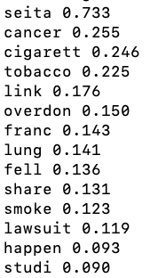

# summarize_document

Summarizes an article in a corpus of 9,000+ articles by returning the top 20 words with the highest TFIDF score. This score considers the frequency of the word in the specified document as well as how many documents in the corpus also contain the word.

Below is the summary of a document titled "Seita affected by cancer link report", an article on how the results of a study affected the stock of a cigarette producer.

